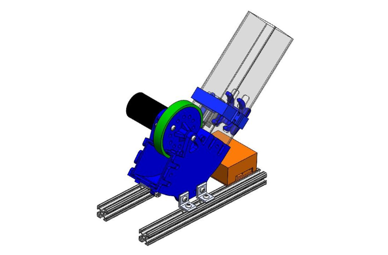
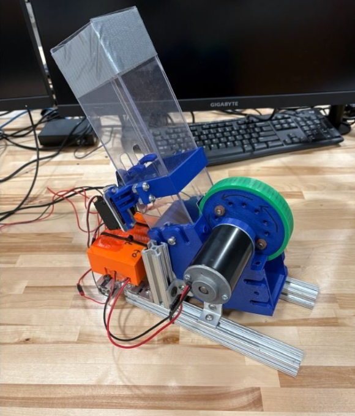

---
title: "Designing NaviGator's Ball Shooter"
authors:
  - name: "Adam McAleer"
    profilePic: "members/adam_m.jpeg"
date: "2024-12-30"
---

## Challenge

The RobotX Maritime Challenge is a biannual competition where universities from around the world compete in a series of challenges using large maritime robots. Challenges at the competition test the robots ability to use sensors to collect information, navigate around obstacles, and manipulate challenge elements. Our lab's robot, NaviGator, competed at RobotX 2024 for the fourth time.

The 2024 iteration of RobotX featured a challenge called "Dock and Deliver", where the robots needed to navigate into a floating dock, and once "docked" the robot had to fire racquetballs into a square target.

Similar challenges to the Dock and Deliver task existed at previous RobotX competitions, but previous solutions built by our lab had been unsuccessful. For the 2022 challenge, a servo-actuated slingshot mechanism was built, but this proved to be inaccurate and difficult to operate. For the 2018 challenge, two counter-rotating flywheels were used to launch the racquetballs, but these too proved to be inaccurate due to highly variable friction if the racquetballs got wet. The drawbacks were addressed by my solution for the 2024 challenge.

## Design Process

I started the design process by researching previous solutions, as well as commercially available solutions. One source of inspiration was baseball pitching machines, as by design they are precise and generally reliable. We briefly toyed with the idea of buying a pitching machine and modifying it, but eventually decided this could prove more expensive and time consuming than creating my own solution as many available launchers are built to be difficult to modify.

After more research and evaluation I came to the conclusion that a single flywheel spinning about the horizontal axis would be the simplest and most effective solution, as long as I addressed some key challenges. These challenges were:

- How to ensure the friction characteristics are consistent (minimizing effects of water and debris)
- How to control the feeding of racquetballs into the mechanism
- How to mount the mechanism to NaviGator securely and rigidly enough to ensure accuracy

To meet these challenges, I began by drawing sketches what components would be necessary. I drew a curved frame that would angle the ball up as it was launcher, and also allow the flywheel to have longer contact with the racquetball. Additionally, I included a tube where the racquetballs could be loaded. By completely encasing the mechanism, the chance of water getting sprayed up into it was minimized, solving the first challenge.

To solve the second challenge, feeding the racquetballs into the flywheel, I designed an attachment to a servo arm that would allow one ball to be fed into the mechanism at a time. The feeding mechanism worked by having a U shape, where one ball would roll into the center of the U, while the walls of the U blocked more balls from entering. This way, only one ball could enter the flywheel at a time, and this could be controlled solely by the motion of the servo.

The final challenge of mounting the mechanism was simpler to solve, as I could create a frame out of 80-20 aluminum extrusion that could be easily adjusted so that the mechanism could be mounted anywhere. This solution worked well as during the development of the ball launcher, the top plane of NaviGator (where the mechanism would be mounted) was being changed, so until that was finished I wouldn't know where I could mount the mechanism.

With these ideas, I spent some time in CAD using SolidWorks to create a mechanism that could implement the solutions to the above challenges. At the same time, I collaborated with our lab's electrical team to choose servos and motors that could be integrated into our system easily.

After a few revisions of the CAD, I created the parts using our lab's 3D printer and a water-jet cutter. Once the custom parts, along with a powerful DC motor and a small servo were assembled, I began testing the launcher in our lab.

## Testing & Improvements

Initial in-lab testing was promising but highlighted a few issues. Firstly, the flywheel broke after being subjected to the high speeds of the beefy DC motor, and also the assembly vibrated significantly. Initially, some high friction tape was wrapped around the flywheel and then screwed on, but this proved to be too flimsy. To rectify that problem, I created a new flywheel using TPU 3D printing filament that could be locked into a new flywheel assembly. This ensured the the flywheel would maintain its shape and not break even while spinning at high speeds. Furthermore, this solved the vibration issue as the newer, more rigid flywheel assembly maintained its symmetry even when subjected to high speed rotation.

After fixing these issues, I mounted the mechanism onto NaviGator and we took it to Lake Wauburg, UF's private lake, for full system testing. We had built a makeshift target that could be held on the dock while NaviGator fired racquetballs at it. This testing was valuable to evaluate how the launcher would perform at the competition. One issue that was highlighted by this testing was the launcher arced the racquetballs higher than predicted, so the boat had to position further away that desired. This increased distance resulted in a loss in accuracy. This was easily rectified by adjusting the 80-20 aluminum mount to lower the exit angle of the racquetballs.

After this, NaviGator headed to RobotX 2024 in Sarasota, Florida!

## Results

At RobotX 2024, the ball launcher was mounted to NaviGator after arriving at the event venue. However, due to some issues with other systems and other tasks having higher priority, the ball launcher was not able to be used at the competition. Despite this, I learned a lot from the project, and we have a working ball launcher for the next iteration of RobotX. I'll be continuing to work on NaviGator until the next competition in 2026!
